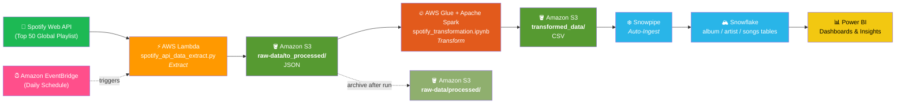
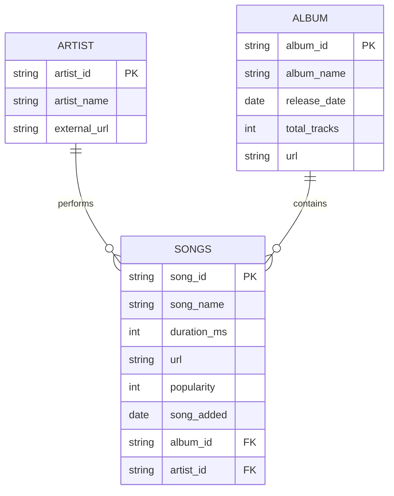

# 🎵 Spotify Data ETL Pipeline on AWS Cloud

An end-to-end, serverless **ETL pipeline** that extracts data from the **Spotify Web API**, transforms it with **AWS Glue + Apache Spark**, loads it into **Snowflake** via **Snowpipe**, and surfaces insights through **Power BI**.


---

## 📌 Table of Contents

- [Overview](#-overview)
- [Architecture](#-architecture)
- [Data Flow](#-data-flow)
- [Data Model](#-data-model)
- [Tech Stack](#-tech-stack)
- [Repository Structure](#-repository-structure)
- [Setup & Deployment](#-setup--deployment)
- [Sample Insights](#-sample-insights)
- [Future Improvements](#-future-improvements)
- [Author](#-author)

---

## 🔎 Overview

This project builds a fully automated data pipeline around Spotify's **"Top 50 – Global"** playlist.

Raw playlist data is pulled from the Spotify API on a schedule, dropped into S3 as JSON, flattened into three clean analytical tables (**albums**, **artists**, **songs**), written back to S3 as CSV, and auto-ingested into Snowflake for analysis and reporting.

**Key characteristics**
- 🟢 **Fully serverless** — no servers to manage; Lambda + Glue scale on demand
- 🔁 **Automated end-to-end** — EventBridge triggers extraction, S3 triggers transformation, Snowpipe triggers loading
- 🧱 **Layered storage** — clear separation between raw and transformed zones in S3
- 📊 **Analytics-ready** — a star-style model that plugs straight into Power BI

---

## 🏗 Architecture



> 💡 GitHub renders Mermaid diagrams natively — the diagram above will display automatically on the repo page.

---

## 🔄 Data Flow

### 1️⃣ Extract — `spotify_api_data_extract.py` (AWS Lambda)

- Authenticates against the Spotify API using **Spotipy** with the *Client Credentials* flow
- Credentials are read from **Lambda environment variables** (`client_id`, `client_secret`) — never hard-coded
- Calls `sp.playlist_tracks(playlist_URI)` for the target playlist
- Writes the raw JSON response to `s3://<bucket>/raw-data/to_processed/spotify_raw_<timestamp>.json`
- Scheduled via **Amazon EventBridge** (e.g. daily)

### 2️⃣ Transform — `spotify_transformation.ipynb` (AWS Glue + PySpark)

Runs on Glue 4.0 (`G.1X`, 5 workers). The nested Spotify JSON is flattened into three tables:

| Function | Output | Logic |
|---|---|---|
| `process_albums()` | `album_df` | `explode(items)` → select album fields → `drop_duplicates(["album_id"])` |
| `process_artists()` | `artist_df` | `explode(items)` → `explode(track.artists)` → `drop_duplicates(["artist_id"])` |
| `process_songs()` | `song_df` | `explode(items)` → select track fields → `to_date(song_added)` |

Results are written back as CSV to `s3://<bucket>/transformed_data/{album_data, artist_data, songs_data}/`.

> An earlier **pandas-based Lambda** implementation (`spotify_transformation_load_function.py`) is kept in the repo to show the evolution from a single-node approach to a distributed Spark job. It also handles archiving processed files from `to_processed/` → `processed/`.

### 3️⃣ Load — Snowpipe → Snowflake

- An **external stage** points at the S3 `transformed_data/` prefix
- **Snowpipe** auto-ingests new CSVs into the `album`, `artist`, and `songs` tables as they land
- No manual `COPY INTO` runs and no batch window to babysit

### 4️⃣ Report — Power BI

Power BI connects directly to Snowflake to build dashboards on top of the modelled tables.

---

## 🗂 Data Model



**S3 layout**

```
s3://spitify-etl-pipline-yasida/
├── raw-data/
│   ├── to_processed/        # new JSON dropped by Lambda  → Glue reads here
│   └── processed/           # archived JSON after a successful run
└── transformed_data/
    ├── album_data/
    ├── artist_data/
    └── songs_data/
```

---

## 🛠 Tech Stack

| Layer | Technology |
|---|---|
| **Language** | Python 3, PySpark, SQL |
| **Extraction** | Spotify Web API, Spotipy, AWS Lambda |
| **Orchestration** | Amazon EventBridge, S3 Event Notifications |
| **Storage** | Amazon S3 (raw + transformed zones) |
| **Transformation** | AWS Glue 4.0, Apache Spark, pandas |
| **Warehouse** | Snowflake, Snowpipe |
| **Visualisation** | Power BI |
| **Libraries** | `spotipy`, `boto3`, `pandas`, `pyspark`, `awsglue` |

---

## 📁 Repository Structure

```
Spotify-Data-ETL-Pipeline-AWS-Cloud-/
├── spotify_api_data_extract.py            # Lambda: Spotify API → S3 (raw JSON)
├── spotify_transformation.ipynb           # Glue/Spark: raw JSON → transformed CSV
├── spotify_transformation_load_function.py# Legacy Lambda: pandas transformation + archiving
└── README.md
```

---

## 🚀 Setup & Deployment

### Prerequisites
- AWS account with access to **Lambda, S3, Glue, IAM**
- **Spotify Developer** account → [create an app](https://developer.spotify.com/dashboard) to get `client_id` / `client_secret`
- A **Snowflake** account and **Power BI Desktop**

### 1. Create the S3 bucket & prefixes
```bash
aws s3 mb s3://<your-bucket-name>
aws s3api put-object --bucket <your-bucket-name> --key raw-data/to_processed/
aws s3api put-object --bucket <your-bucket-name> --key raw-data/processed/
aws s3api put-object --bucket <your-bucket-name> --key transformed_data/
```

### 2. Deploy the extraction Lambda
1. Create a Python 3.x Lambda function and upload `spotify_api_data_extract.py`
2. Attach a **Lambda layer** containing `spotipy`
3. Add environment variables:
   | Key | Value |
   |---|---|
   | `client_id` | your Spotify client ID |
   | `client_secret` | your Spotify client secret |
4. Grant the execution role `s3:PutObject` on the bucket
5. Increase timeout to ~30s and add an **EventBridge** schedule (e.g. `rate(1 day)`)

### 3. Run the Glue job
1. Create a Glue **Notebook / Job** (Glue 4.0, worker `G.1X`, 5 workers)
2. Import `spotify_transformation.ipynb`
3. Update `s3_path` to your bucket
4. Give the Glue IAM role read/write access to the bucket, then run or schedule the job

### 4. Configure Snowflake + Snowpipe
```sql
CREATE OR REPLACE STORAGE INTEGRATION spotify_s3_int
  TYPE = EXTERNAL_STAGE
  STORAGE_PROVIDER = 'S3'
  ENABLED = TRUE
  STORAGE_AWS_ROLE_ARN = '<your-iam-role-arn>'
  STORAGE_ALLOWED_LOCATIONS = ('s3://<your-bucket-name>/transformed_data/');

CREATE OR REPLACE FILE FORMAT csv_ff
  TYPE = CSV FIELD_DELIMITER = ',' SKIP_HEADER = 1
  FIELD_OPTIONALLY_ENCLOSED_BY = '"';

CREATE OR REPLACE STAGE spotify_stage
  URL = 's3://<your-bucket-name>/transformed_data/'
  STORAGE_INTEGRATION = spotify_s3_int
  FILE_FORMAT = csv_ff;

CREATE OR REPLACE PIPE songs_pipe AUTO_INGEST = TRUE AS
  COPY INTO songs FROM @spotify_stage/songs_data/;
```
Repeat the pipe for `album_data/` and `artist_data/`, then wire the **SQS ARN** from `DESCRIBE PIPE` into an S3 event notification.

### 5. Connect Power BI
Use **Get Data → Snowflake**, point it at your warehouse/database, and build the reports.

---

## 📈 Sample Insights

- Top 10 tracks by **popularity** across the global playlist
- Artists with the **most tracks** in the Top 50
- **Track duration** distribution and average song length
- Popularity trends by **album release year**
- New entries over time using `song_added`

---

## 🧭 Future Improvements

- [ ] Migrate the transformed zone from CSV to **Parquet** for cheaper, faster queries
- [ ] Add **AWS Glue Crawler + Data Catalog** and query with Athena
- [ ] Orchestrate with **Step Functions** or **Airflow (MWAA)** for retries and lineage
- [ ] Implement **incremental / SCD Type 2** loading in Snowflake with `dbt`
- [ ] Add **data quality checks** (Great Expectations / Glue Data Quality)
- [ ] CI/CD with **GitHub Actions** and infra-as-code via **Terraform**
- [ ] CloudWatch alarms + dead-letter queues for failure alerting

---

## 👤 Author

**Yasida Wanigatunga**

🔗 Repository: [Spotify-Data-ETL-Pipeline-AWS-Cloud-](https://github.com/YasidaWanigatunga/Spotify-Data-ETL-Pipeline-AWS-Cloud-)

⭐ If you found this project useful, consider giving it a star!

---

<sub>Data sourced from the Spotify Web API. This project is for educational purposes and is not affiliated with or endorsed by Spotify.</sub>
